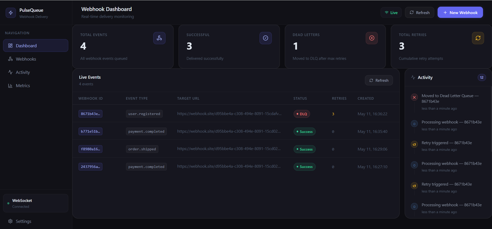

# PulseQueue

A distributed webhook delivery platform built with FastAPI, Kafka, PostgreSQL, Redis, Prometheus, Grafana, and WebSockets.

PulseQueue focuses on reliable asynchronous event delivery with retries, dead-letter queues (DLQ), realtime monitoring, and observability.

---

## Dashboard Preview



# Architecture Overview

```text
Client
  ↓
FastAPI API
  ↓
Kafka Topic Queue
  ↓
Async Worker Consumers
  ↓
Webhook Delivery
  ↓
Redis Pub/Sub
  ↓
Realtime WebSocket Dashboard

PostgreSQL → Durable persistence
Prometheus → Metrics collection
Grafana → Observability dashboards
```

---

# Features

## Reliable Webhook Delivery

* Asynchronous event processing
* Kafka-backed queue architecture
* Durable PostgreSQL persistence
* Concurrent worker processing

## Retry System

* Automatic retries for failed deliveries
* Exponential backoff strategy
* Failure tracking

## Dead Letter Queue (DLQ)

* Failed jobs moved safely to DLQ
* Prevents infinite retry loops
* Enables failure inspection and replay

## Realtime Infrastructure Dashboard

* Live webhook event monitoring
* WebSocket-powered realtime updates
* Activity feed
* Delivery status tracking

## Observability

* Prometheus metrics
* Grafana dashboards
* Retry/failure monitoring
* WebSocket connection tracking

---

# Tech Stack

## Backend

* FastAPI
* Python asyncio
* SQLAlchemy
* PostgreSQL
* Redis
* Kafka
* WebSockets

## Observability

* Prometheus
* Grafana

## Frontend

* React
* Vite
* TailwindCSS

## Infrastructure

* Docker
* Docker Compose

---

# System Flow

## 1. Webhook Creation

Client submits webhook event:

```http
POST /webhooks
```

Example payload:

```json
{
  "webhook_url": "https://webhook.site/example",
  "event_type": "payment.completed",
  "payload": {
    "amount": 500,
    "currency": "USD"
  }
}
```

---

## 2. Event Persistence

The API:

* validates payload
* stores event in PostgreSQL
* marks status as `QUEUED`

---

## 3. Kafka Queue Processing

The event is published into Kafka:

```text
webhooks.created
```

Kafka acts as the distributed event buffer.

---

## 4. Worker Consumption

Async workers consume events from Kafka.

Workers:

* process deliveries concurrently
* update job states
* track retries
* publish realtime updates

---

## 5. Webhook Delivery

Workers send actual HTTP POST requests to destination URLs.

Successful deliveries are marked:

```text
SUCCESS
```

---

## 6. Retry Mechanism

If delivery fails:

* retries trigger automatically
* exponential backoff applied

Example:

```text
2s → 4s → 8s
```

---

## 7. Dead Letter Queue

After maximum retries:

```text
DLQ
```

The failed webhook is moved into a dead-letter queue.

---

## 8. Realtime Updates

Redis Pub/Sub broadcasts:

* processing updates
* retry events
* success/failure states

Frontend receives updates instantly through WebSockets.

---

# Dashboard

PulseQueue includes a realtime infrastructure dashboard.

Features:

* Live webhook events table
* Delivery status tracking
* Retry monitoring
* DLQ visualization
* Activity timeline
* Realtime websocket updates

---

# Observability

## Prometheus Metrics

Tracked metrics include:

* processed jobs
* failed jobs
* retry counts
* processing duration
* active websocket connections

---

## Grafana Dashboards

Grafana visualizes:

* delivery throughput
* retries
* failures
* websocket activity
* processing metrics

---

# Project Structure

```text
pulsequeue/
│
├── api/
│   ├── db/
│   ├── routes/
│   ├── schemas/
│   ├── services/
│   └── websocket/
│
├── worker/
│   ├── consumer.py
│   ├── delivery_service.py
│   ├── dlq_producer.py
│   └── redis_publisher.py
│
├── shared/
│   └── config.py
│
├── frontend/
│
├── docker-compose.yml
├── prometheus.yml
└── README.md
```

---

# Local Setup

## Clone Repository

```bash
git clone https://github.com/Robin-singh24/QueuePulse.git
cd pulsequeue
```

---

## Environment Variables

Create `.env`

```env
DATABASE_URL=
KAFKA_BOOTSTRAP_SERVERS=
REDIS_URL=
KAFKA_TOPIC_WEBHOOKS=webhooks.created
MAX_RETRIES=3
MAX_CONCURRENT_JOBS=10
```

---

## Run Infrastructure

```bash
docker compose up --build
```

---

# Services

| Service            | URL                                                      |
| ------------------ | -------------------------------------------------------- |
| FastAPI            | [http://localhost:8000](http://localhost:8000)           |
| Swagger Docs       | [http://localhost:8000/docs](http://localhost:8000/docs) |
| Grafana            | [http://localhost:3000](http://localhost:3000)           |
| Prometheus         | [http://localhost:9090](http://localhost:9090)           |
| Frontend Dashboard | [http://localhost:5173](http://localhost:5173)           |

---

# Example Webhook Request

```json
{
  "webhook_url": "https://webhook.site/example",
  "event_type": "payment.completed",
  "payload": {
    "amount": 500,
    "currency": "USD",
    "customer_id": "cust_123"
  }
}
```

---

# Supported Event Types

* `payment.completed`
* `order.shipped`
* `user.registered`

---

# Failure Testing

Use an invalid webhook URL to test retries and DLQ behavior.

```json
{
  "webhook_url": "https://invalid-url.com/webhook",
  "event_type": "payment.failed",
  "payload": {
    "amount": 999,
    "currency": "INR"
  }
}
```

---

# Future Improvements

* Replay failed DLQ events
* Webhook signature verification
* Multi-tenant support
* Authentication & API keys
* Rate limiting
* Event replay tooling
* Kubernetes deployment
* Cloud-native Kafka deployment
* Advanced analytics dashboards

---

# Why This Project?

Modern distributed systems rely heavily on event-driven communication.

PulseQueue demonstrates:

* asynchronous system design
* distributed messaging
* reliability engineering
* retry strategies
* realtime infrastructure monitoring
* observability best practices

This project focuses on backend systems engineering rather than simple CRUD application development.

---

# Author

Robin Singh

Backend / Distributed Systems Engineering Project
